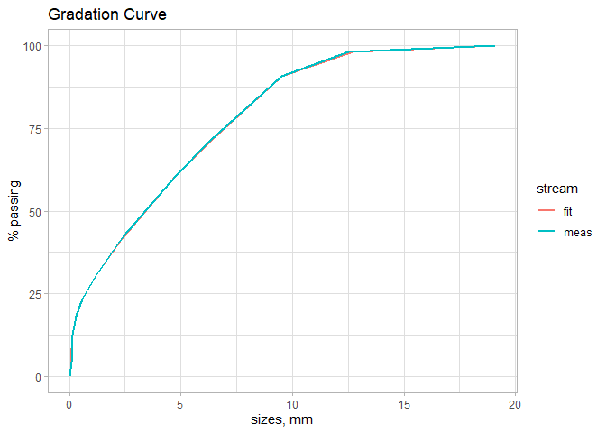
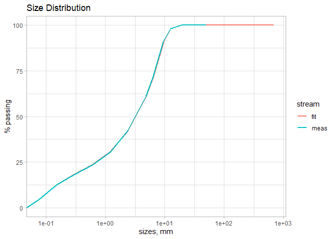

<!-- README.md is generated from README.Rmd. Please edit that file -->

# gRadations: Dealing with Size Distributions

<!-- badges: start -->

[](https://github.com/octaviodeliberato/gRadations/actions/workflows/R-CMD-check.yaml)
<!-- badges: end -->

The goal of gRadations is to allow the representation of size
distributions by means of curve fitting.

## Installation

You can install the development version of gRadations from
[GitHub](https://github.com/) with:

``` r
# install.packages("devtools")
devtools::install_github("octaviodeliberato/gRadations")
```

## Example

This is a basic example which shows you how to interpolate a gradation
with splines:

``` r
library(gRadations)

grad_lst <- size_distributions |> 
  dplyr::group_by(id, .add = TRUE) |> 
  dplyr::group_split()

dplyr::glimpse(grad_lst[[1]])
#> Rows: 15
#> Columns: 4
#> $ id     <chr> "Ensaio granulometrico TC-10", "Ensaio granulometrico TC-10", "…
#> $ x      <dbl> 50.000, 37.500, 25.400, 19.100, 12.500, 9.500, 6.300, 4.800, 2.…
#> $ y      <dbl> 100.0, 100.0, 100.0, 100.0, 98.1, 90.7, 71.2, 60.8, 42.2, 30.6,…
#> $ stream <chr> "lab", "lab", "lab", "lab", "lab", "lab", "lab", "lab", "lab", …

grad_fit_lst <- vector(mode = "list", length = length(grad_lst))

for (i in seq_along(grad_lst)) {

  grad_fit_lst[[i]] <- fit_gradation(
    gradation_tbl = grad_lst[[i]] |> 
      dplyr::select(x, y),
    sizes = c(692, 300, 125, 88.9, 63.5, 44.4, 31.7, 19.1, 12.7,
              9.52, 6.35, 4.76, 2.38, 1.19, 0.59, 0.297, 0.149, 0.074),
    method = "SP",
    plotly = FALSE
  )

}

grad_fit_lst[[1]][["plot_x"]]
```



``` r
grad_fit_lst[[1]][["plot_log10_x"]]
```


